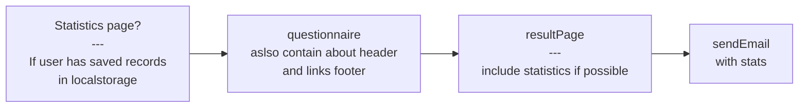

## Data model

```
item
{
    itemName:{en:""}
    itemValues:[1,2,3,4]
    score:""
    scoreName:{en:""}
    scoreValues:[1,2,3,4]|[4,3,2,1]
}
```

```
record
{
    date:datetime
    scores:[Score]
}
```

```
user
{
    id:uniqueid
    records[Record]
    settings:{}
}
```


## Data
items = ["Tense", "Angry", "Worn Out", "Unhappy", "Proud", "Lively", "Confused", "Sad", "Active", "On-edge", "Grouchy", "Ashamed", "Energetic", "Hopeless", "Uneasy", "Restless", "Unable to concentrate", "Fatigued", "Competent", "Annoyed", "Discouraged", "Resentful", "Nervous", "Miserable", "Confident", "Bitter", "Exhausted", "Anxious", "Helpless", "Weary", "Satisfied", "Bewildered", "Furious", "Full of Pep", "Worthless", "Forgetful", "Vigorous", "Uncertain about things", "Bushed", "Embarrassed"]

scores = [
    {"score": "TEN", "scoreName": {"en": "Tension"}},
    {"score": "ANG", "scoreName": {"en": "Anger"}},
    {"score": "FAT", "scoreName": {"en": "Fatigue"}},
    {"score": "DEP", "scoreName": {"en": "Depression"}},
    {"score": "EST", "scoreName": {"en": "Esteem-related Affect"}},
    {"score": "VIG", "scoreName": {"en": "Vigor"}},
    {"score": "CON", "scoreName": {"en": "Confusion"}},
    {"score": "TMD", "scoreName": {"en": "Total Mood Disturbance"}},
]


## wireflow


items =[
    {
        itemName:{1|2|3|4}
    }
]

scores = [
    scoreName: {
        itemName:{default | reversed}
        itemName:reversed
    }
]

score = for items in scoreName:
    items.


scores[]
for items:
    scores[scoreAbreviation] += scoreValue

items.map
inputName = itemName
range = scoreValues(1,2,3,4)