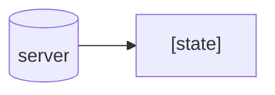
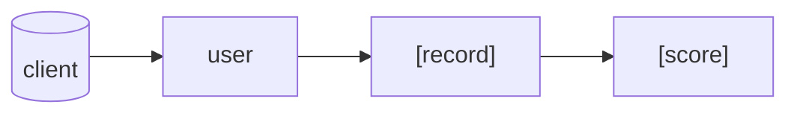

# Data model

## Entities

Application stores a constant array of a mood `state`s:



`moodState` represent feeling,listed in Abbreviated POMS questionnaire, which user has to evaluate.

Multiple `state`s are used to calculate specific mood `dimension`. Some `state`s have inverse affect on `dimension`,
i.e. `stateScore == 3` adds `1` to `dimensionScore`.

```js
// state
{
  state: "XXX";
  stateScores: [0, 1, 2, 3, 4];
  dimension: "XXX"; // score abbreviation i.e. ANG which is affected by this item.
  dimensionScores: {
    [0, 1, 2, 3, 4] | [4, 3, 2, 1, 0];
  } // mapping of itemValue to scoreValue
}
```

On a client side `user`'s data is stored:



`user` has an array of `record`s, `id` and `settings`:

```js
// user
{
  id: uniqueid;
  scores[scores];
  settings: {
  }
}
```

`record` is an array of `score`s':

```js
// record
{
  date: datetime;
  scores: [score];
}
```

```js
// score
{
  dimension: "XXX";
  score: Number;
}
```

## Data

```js
states = [
  "Tense",
  "Angry",
  "Worn Out",
  "Unhappy",
  "Proud",
  "Lively",
  "Confused",
  "Sad",
  "Active",
  "On-edge",
  "Grouchy",
  "Ashamed",
  "Energetic",
  "Hopeless",
  "Uneasy",
  "Restless",
  "Unable to concentrate",
  "Fatigued",
  "Competent",
  "Annoyed",
  "Discouraged",
  "Resentful",
  "Nervous",
  "Miserable",
  "Confident",
  "Bitter",
  "Exhausted",
  "Anxious",
  "Helpless",
  "Weary",
  "Satisfied",
  "Bewildered",
  "Furious",
  "Full of Pep",
  "Worthless",
  "Forgetful",
  "Vigorous",
  "Uncertain about things",
  "Bushed",
  "Embarrassed",
];
```

```js
MoodDimensions = [
  { score: "TEN", scoreName: { en: "Tension" } },
  { score: "ANG", scoreName: { en: "Anger" } },
  { score: "FAT", scoreName: { en: "Fatigue" } },
  { score: "DEP", scoreName: { en: "Depression" } },
  { score: "EST", scoreName: { en: "Esteem-related Affect" } },
  { score: "VIG", scoreName: { en: "Vigor" } },
  { score: "CON", scoreName: { en: "Confusion" } },
  { score: "TMD", scoreName: { en: "Total Mood Disturbance" } },
];
```

```js
moodDimensions = {
    "TEN": { emotionScoring: {
            tense: "default",
            onEdge: "default",
            uneasy: "default",
            restless: "default",
            nervous: "default",
            anxious: "default",
        }},
    "ANG": {emotionScoring: {
        angry:"default",
        grouchy:"default",
        annoyed:"default",
        resentful:"default",
        bitter:"default",
        furious:"default",
    }},
    "FAT": {emotionScoring: {
        wornOut:"default",
        watigued:"default",
        exhausted:"default",
        weary:"default",
        bushed:"default",
    }},
    "DEP": {emotionScoring: {
        unhappy:"default",
        sad:"default",
        hopeless:"default",
        discouraged:"default",
        miserable:"default",
        helpless:"default",
        worthless:"default",
    }},
    "ERA": {emotionScoring: {
        proud:"default",
        ashamed:"reversed",
        competent:"default",
        confident:"default",
        satisfied:"default",
        embarrassed:"reversed",
    }},
    "VIG": { emotionScoring: {
        lively:"default",
        active:"default",
        energetic:"default",
        fullOfPep:"default",
        vigorous:"default",
    }},
    "CON": { emotionScoring: {
        confused:"default",
        cantConcentrate:"default",
        bewildered:"default",
        forgetful:"default",
        uncertainAboutThings:"default",
    }}   
}
```

"TMD": "scoreName": {"en": "Total Mood Disturbance"}},
