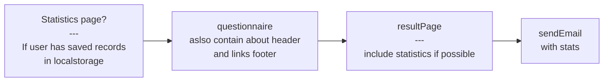

## Base scenario 

```mermaid
flowchart LR

stat[Statistics page?
---
If user has saved records
in localstorage] -->
form[questionnaire
aslso contain about header
and links footer] -->
result[resultPage
---
include statistics if possible] -->
email[sendEmail
with stats]
```